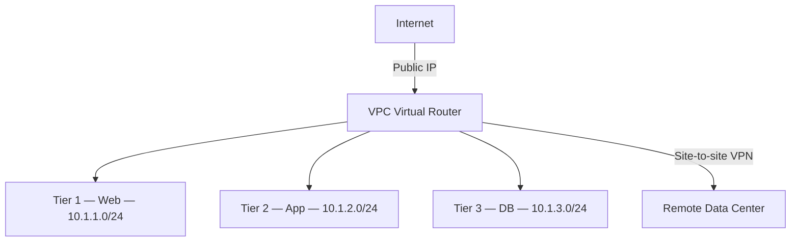

CloudStack networking is built around a plugin model. Every network service — DHCP, DNS, firewall, NAT, load balancing, VPN — is provided by a **network element**. The management server selects which element fulfils each service based on the **network offering** attached to the network. This design lets operators swap out the Virtual Router for a hardware appliance or SDN controller without changing the API surface exposed to tenants.

## Physical network and traffic types

Before any guest network is provisioned, an administrator configures one or more **physical networks** in a zone. Each physical network maps to one or more physical NICs or VLAN trunks on the hypervisor hosts. Traffic is segmented by type:

| Traffic type | Purpose |
|-------------|---------|
| `Management` | Management server ↔ Agent communication (port 8250) and system VM traffic |
| `Guest` | Tenant VM east-west and north-south traffic |
| `Public` | Internet-facing IPs assigned to Virtual Routers and load balancers |
| `Storage` | NFS/iSCSI traffic to primary and secondary storage |

Traffic types are defined in `com.cloud.network.Networks.TrafficType` and are assigned to physical networks during zone setup.

## Basic zone networking

In a Basic zone, all guest VMs share a **shared network** that spans the pod. There is no Layer-3 isolation between tenants; security groups (`SecurityGroupManagerImpl`) handle per-VM access control at the hypervisor level using iptables rules pushed via the CloudStack Agent.

Key characteristics:

- Single flat guest VLAN per pod
- DHCP served by the Virtual Router (`DirectPodBasedNetworkGuru`)
- Security groups provide ingress and egress filtering
- Public IPs are assigned directly to guest VMs (no NAT)
- No VPC, no isolated networks

<Note>
Basic zones are suitable for simple deployments where tenants trust each other or where security groups provide sufficient isolation. Advanced zones are recommended for multi-tenant public clouds.
</Note>

## Advanced zone networking

Advanced zones provide full Layer-3 network isolation. Each tenant network receives a dedicated Virtual Router that acts as the default gateway and network-services appliance for that network.

### Isolated networks

An **isolated network** is a private Layer-3 network with a unique VLAN or VXLAN tag. The Virtual Router attached to the network provides:

- DHCP and DNS for guest VMs
- Source NAT (the router's public IP is the egress address for the entire network)
- Static NAT (1:1 mapping of a public IP to a guest VM)
- Port forwarding (DNAT rules for specific TCP/UDP ports)
- Ingress and egress firewall rules
- Remote-access VPN (PPTP, L2TP/IPsec)
- Load balancing via HAProxy (algorithms: `roundrobin`, `leastconn`, `source`)

Network isolation and service capabilities are declared in `VirtualRouterElement.setCapabilities()`:

```java
// From com.cloud.network.element.VirtualRouterElement
lbCapabilities.put(Capability.SupportedLBAlgorithms, "roundrobin,leastconn,source");
lbCapabilities.put(Capability.SupportedProtocols, "tcp, udp, tcp-proxy, ssl");
lbCapabilities.put(Capability.SslTermination, "true");
vpnCapabilities.put(Capability.SupportedVpnProtocols, "pptp,l2tp,ipsec");
firewallCapabilities.put(Capability.SupportedProtocols, "tcp,udp,icmp");
firewallCapabilities.put(Capability.SupportedTrafficDirection, "ingress, egress");
```

### VPC (Virtual Private Cloud)

A **VPC** groups multiple isolated networks (tiers) under a single private address space. Each tier is a subnet inside the VPC CIDR. A single **VPC Virtual Router** (`VpcVirtualNetworkApplianceManagerImpl`) handles routing between tiers and provides all the services listed above plus:

- Network ACLs between tiers (per-tier ingress/egress rules)
- Site-to-site VPN to remote data centers
- Private gateways to directly connected physical networks
- Static routes

VPC management is implemented in `com.cloud.network.vpc.VpcManagerImpl`. The VPC Virtual Router element is `com.cloud.network.element.VpcVirtualRouterElement`.



## Network offerings

A **network offering** is a named collection of services and their providers. When a tenant creates a network, they pick a network offering that determines which services are available and which network elements fulfil them.

Services available in a network offering:

| Service | Default provider |
|---------|----------------|
| `Dhcp` | `VirtualRouter` |
| `Dns` | `VirtualRouter` |
| `Firewall` | `VirtualRouter` |
| `Gateway` | `VirtualRouter` |
| `Lb` (load balancer) | `VirtualRouter` |
| `PortForwarding` | `VirtualRouter` |
| `SourceNat` | `VirtualRouter` |
| `StaticNat` | `VirtualRouter` |
| `UserData` | `VirtualRouter` |
| `Vpn` | `VirtualRouter` |
| `SecurityGroup` | `SecurityGroupProvider` |

Administrators can create custom network offerings that substitute external appliances for any of these services.

## Virtual Router as network element

The Virtual Router (VR) is a Debian-based appliance VM managed by `VirtualNetworkApplianceManagerImpl`. CloudStack deploys it automatically when the first guest VM joins an isolated network or VPC tier.

The VR exposes a control channel on its management NIC. The management server pushes configuration updates as `Command` objects through the CloudStack Agent running inside the VR:

- `DhcpEntryRules` — add/remove DHCP leases
- `FirewallRules` — push iptables rules
- `LoadBalancingRules` — update HAProxy configuration
- `StaticNatRules` / `IpAssociationRules` — configure DNAT/SNAT
- `BgpPeersRules` — configure BGP peer sessions (from `com.cloud.network.rules.BgpPeersRules`)
- `BasicVpnRules` / `AdvancedVpnRules` — configure VPN tunnels

The VR can be made **redundant**: two VR VMs run in active/standby mode using keepalived/VRRP. Redundant routers are declared with `Capability.RedundantRouter = "true"` in the network offering.

## External network devices

The `plugins/network-elements/` directory contains plugins that replace or augment the Virtual Router with external hardware or SDN controllers:

<AccordionGroup>
  <Accordion title="Citrix NetScaler (netscaler)">
    Replaces the VR's load-balancer service with a NetScaler ADC appliance. Supports advanced LB algorithms, SSL offloading, and connection persistence beyond HAProxy's capabilities.
  </Accordion>
  <Accordion title="VMware NSX (nsx)">
    Integrates with VMware NSX-T to provide software-defined networking for VMware vSphere zones. Handles logical switching, routing, and distributed firewall in NSX rather than the VR.
  </Accordion>
  <Accordion title="Nicira NVP / OpenDaylight / OVS (nicira-nvp, opendaylight, ovs)">
    SDN plugins that use OpenFlow-based overlays (NVP, OpenDaylight, Open vSwitch) to replace or supplement VR-based networking.
  </Accordion>
  <Accordion title="Juniper Contrail (juniper-contrail)">
    Provides SDN networking using Juniper's Contrail/Tungsten Fabric controller.
  </Accordion>
  <Accordion title="Tungsten Fabric (tungsten)">
    Open-source SDN using Tungsten Fabric (OpenContrail). Integrated at the KVM hypervisor level via vRouter agents.
  </Accordion>
  <Accordion title="Palo Alto (palo-alto)">
    Replaces the VR firewall service with a Palo Alto Networks next-generation firewall.
  </Accordion>
  <Accordion title="Internal load balancer (internal-loadbalancer)">
    Provides load balancing inside a VPC tier without an external device. Uses a dedicated Internal Load Balancer VM based on the same VR appliance image.
  </Accordion>
  <Accordion title="Elastic load balancer (elastic-loadbalancer)">
    Manages NetScaler instances elastically, allocating and deallocating ADC capacity as load-balancer demand changes.
  </Accordion>
  <Accordion title="GloboDNS / DNS notifier (globodns, dns-notifier)">
    Integrates with external DNS systems to register guest VM hostnames automatically.
  </Accordion>
  <Accordion title="Netris (netris)">
    Provides BGP-based underlay networking using Netris network operating system for bare-metal and cloud deployments.
  </Accordion>
</AccordionGroup>

## BGP and IPv6 support

CloudStack includes BGP peering support for advanced routing scenarios. The `BGPServiceImpl` class (`com.cloud.bgp.BGPServiceImpl`) manages BGP peer configurations. The `BgpPeersRules` command (`com.cloud.network.rules.BgpPeersRules`) pushes BGP peer session configuration to Virtual Routers.

IPv6 is supported through `Ipv6ServiceImpl` (`com.cloud.network.Ipv6ServiceImpl`) and `Ipv6AddressManagerImpl`. IPv6 addresses can be assigned to guest VMs in Advanced zones, and the Virtual Router handles IPv6 routing and stateless address autoconfiguration (SLAAC).

## Network services reference

<Tabs>
  <Tab title="DHCP / DNS">
    DHCP leases are managed per-VM by the Virtual Router. When a VM starts, a `DhcpEntryRules` command is sent to the VR to register the VM's MAC address and assigned IP. The VR runs `dnsmasq` to serve DHCP and DNS.

    DNS forwarding is configurable; the VR passes queries to the zone's DNS servers defined during zone setup. The `AllowDnsSuffixModification` capability (`Capability.AllowDnsSuffixModification = "true"`) lets administrators set per-network DNS search domains.
  </Tab>
  <Tab title="NAT and port forwarding">
    **Source NAT** maps all outbound traffic from a guest network to the VR's public IP using iptables MASQUERADE or SNAT rules.

    **Static NAT** creates a 1:1 mapping of a public IP to a specific guest VM IP using DNAT rules managed by `StaticNatRules`.

    **Port forwarding** creates DNAT rules for specific TCP/UDP ports. Supported protocols: `tcp`, `udp` (from `Capability.SupportedProtocols` in `portForwardingCapabilities`).
  </Tab>
  <Tab title="Firewall">
    The VR firewall supports ingress and egress rules with protocols `tcp`, `udp`, `icmp`, and `all`. Traffic statistics are tracked per-public-IP.

    In Basic zones, security groups use `iptables` rules installed directly on hypervisor hosts via `SecurityGroupManagerImpl`. This approach does not require a VR in the data path.
  </Tab>
  <Tab title="Load balancing">
    The VR uses HAProxy for load balancing. Supported algorithms: `roundrobin`, `leastconn`, `source`. Supported protocols: `tcp`, `udp`, `tcp-proxy`, `ssl`. SSL termination is supported (`SslTermination = "true"`).

    Stickiness methods include `LbCookieBased` and `SourceBased` (source IP table). AutoScaling integration is available via `VmAutoScaling = "true"`.
  </Tab>
  <Tab title="VPN">
    Remote-access VPN supports PPTP, L2TP, and IPsec protocols (`SupportedVpnProtocols = "pptp,l2tp,ipsec"`). The VPN type is `remoteaccessvpn`.

    Site-to-site VPN is available in VPCs and is implemented by `Site2SiteVpnManagerImpl`. Static routes or BGP peering route traffic between VPC subnets and remote networks through IPsec tunnels.
  </Tab>
</Tabs>
