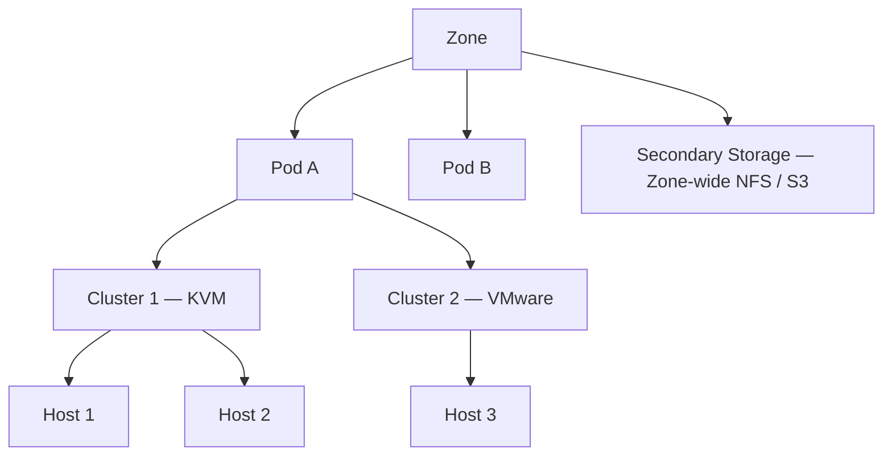
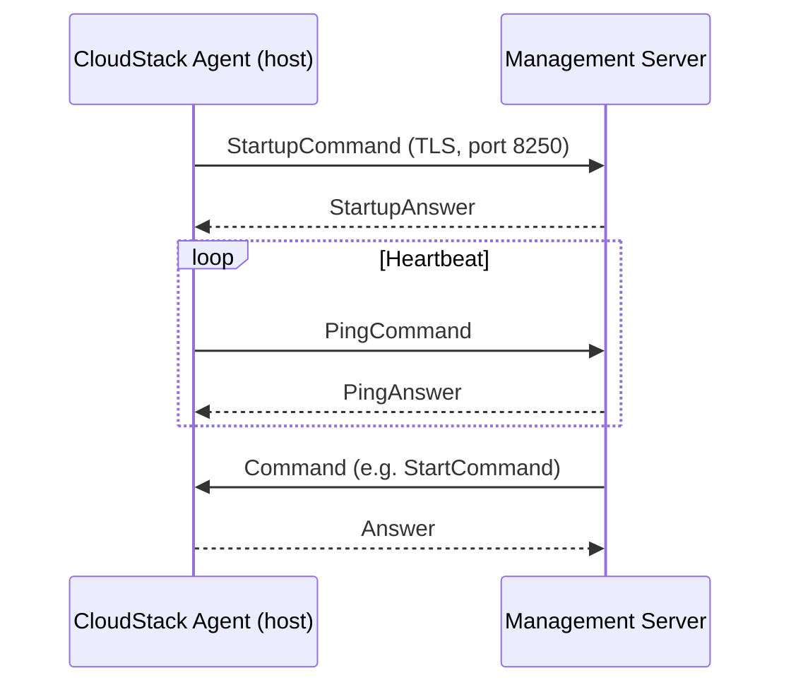

Apache CloudStack is an open-source IaaS platform that deploys and manages large networks of virtual machines. Its architecture is built around a central management server that orchestrates compute, network, and storage resources organised into a strict geographic and logical hierarchy.

## Management server

The management server (`ManagementServerImpl`) is the control plane of a CloudStack deployment. It exposes a REST/query API, processes all user and administrative requests, and dispatches commands to hypervisor hosts through the CloudStack Agent protocol.

Key responsibilities handled by `com.cloud.server.ManagementServerImpl`:

- Lifecycle management of virtual machines (start, stop, migrate, destroy)
- Orchestration of network and storage resources
- Account, user, domain, and resource-limit management
- Template and ISO management
- Usage accounting and event generation
- High-availability monitoring and host fencing
- Console proxy access (`setConsoleAccessForVm`, `getConsoleAccessUrlRoot`)

Multiple management server nodes can run simultaneously. Node coordination uses a database-based cluster mechanism implemented in `com.cloud.cluster.ClusterManagerImpl`. Each node registers in the `mshost` database table and heartbeats its peers; if a node stops heartbeating, its agents are redistributed to the surviving nodes.

<Note>
CloudStack does not use ZooKeeper for cluster coordination. Management server clustering relies entirely on MySQL: each node holds a persistent TCP connection to the database (`ConnectionConcierge`) and uses row-level locking to elect work ownership.
</Note>

## Infrastructure hierarchy

Every resource in CloudStack lives inside a strict four-level hierarchy. Understanding this hierarchy is essential before designing a deployment.

| Level | Concept | Description |
|-------|---------|-------------|
| 1 | **Zone** | Maps to a physical data center or availability zone. Contains one or more pods. Defines the network type (Basic or Advanced). |
| 2 | **Pod** | A rack or row of racks within a zone. Shares a Layer-2 broadcast domain. Contains clusters and a pod-level management network. |
| 3 | **Cluster** | A group of homogeneous hypervisor hosts that share primary storage. All hosts in a cluster run the same hypervisor type and version. |
| 4 | **Host** | An individual hypervisor machine (physical or nested). Runs the CloudStack Agent and executes VM workloads. |

Secondary storage (NFS, S3, Swift) is scoped at the zone level and is shared by all pods in a zone.

## Zone types

CloudStack zones come in two networking modes. The zone type determines which network topologies are available to tenants.

<Tabs>
  <Tab title="Basic zone">
    In a Basic zone all guest VMs share a single flat Layer-2 network (a **shared network**). There is no network isolation between tenants at the L2 level; security groups provide per-VM ingress and egress filtering instead.

    - Flat networking — one shared guest VLAN across the pod
    - Security groups for per-VM firewall rules
    - DHCP served by the Virtual Router or an external DHCP server
    - No VPC support
    - Simpler to operate; suited for smaller deployments or test environments

    The network guru used for Basic zones is `DirectPodBasedNetworkGuru` (`com.cloud.network.guru.DirectPodBasedNetworkGuru`).
  </Tab>
  <Tab title="Advanced zone">
    In an Advanced zone tenants receive fully isolated Layer-3 networks. Each isolated network or VPC gets its own Virtual Router that provides DHCP, DNS, NAT, firewall, load balancing, VPN, and port-forwarding services.

    - Isolated networks (one Virtual Router per network)
    - VPC (Virtual Private Cloud) support with tiered subnets
    - Per-account or per-VPC source-NAT IP addresses
    - Site-to-site and remote-access VPN
    - External network devices (Netscaler, F5, NSX, Juniper) pluggable via network elements

    The network guru for Advanced zones is `GuestNetworkGuru` (`com.cloud.network.guru.GuestNetworkGuru`).
  </Tab>
</Tabs>

## System VMs

CloudStack deploys three types of system virtual machines automatically. These VMs run a lightweight Debian-based appliance image and are managed entirely by the management server.

<CardGroup cols={3}>
  <Card title="Console Proxy VM" icon="monitor">
    Provides browser-based console access to guest VMs via WebSocket/AJAX. The management server locates the CPVM through `getConsoleAccessUrlRoot`. Implemented in `com.cloud.consoleproxy.ConsoleProxyManagerImpl`.
  </Card>
  <Card title="Secondary Storage VM" icon="hard-drive">
    Mounts NFS or object storage and handles template/ISO downloads, snapshot copying, and volume migration across zones. One SSVM per zone.
  </Card>
  <Card title="Virtual Router" icon="router">
    A per-network or per-VPC appliance that provides DHCP, DNS, source NAT, static NAT, port forwarding, firewall, load balancing, and VPN services. Implemented in `com.cloud.network.router.VirtualNetworkApplianceManagerImpl` and `VpcVirtualNetworkApplianceManagerImpl`.
  </Card>
</CardGroup>

## Agent communication

Each KVM, XenServer, or Hyper-V host runs a **CloudStack Agent** (`com.cloud.agent.Agent`). The agent:

1. Opens an outbound TLS TCP connection to the management server on port 8250.
2. Sends a `StartupCommand` identifying the host type, capabilities, and resources.
3. Receives `Command` objects from the management server and returns `Answer` objects.
4. Sends periodic `PingCommand` heartbeats to indicate liveness.

The agent supports load-balanced connections across multiple management server nodes via `SetupMSListCommand` (from `org.apache.cloudstack.agent.lb`). If the primary management server becomes unreachable, the agent reconnects to another node in the list.

For VMware, there is no per-host agent. Instead, the management server communicates with vCenter through the VMware API via `VmwareResource` (`com.cloud.hypervisor.vmware.resource.VmwareResource`).

## Database layer

CloudStack uses MySQL as its sole persistent data store. All metadata — zones, pods, clusters, hosts, VMs, networks, storage pools, accounts, and configurations — is stored in MySQL tables managed through the DAO layer in `com.cloud.utils.db`.

The `framework/db` module provides:
- `DB` annotation for transactional methods
- `Transaction` / `TransactionLegacy` utilities for managing JDBC connections
- `DbProperties` for reading `db.properties` at startup

<Warning>
CloudStack does not support PostgreSQL or other databases. MySQL 8.x (or a compatible MariaDB version) is required.
</Warning>

## Scalability considerations

<AccordionGroup>
  <Accordion title="Multiple management server nodes">
    Add management server nodes to increase API throughput and eliminate single points of failure. Each node registers in the `mshost` table. Agents connect to any node and are redistributed automatically on node failure through `ClusterManagerImpl`.
  </Accordion>
  <Accordion title="Zone and pod design">
    A single zone supports thousands of hosts across multiple pods. Splitting workloads across zones provides stronger fault isolation since zones have independent secondary storage, system VMs, and physical networks.
  </Accordion>
  <Accordion title="Database sizing">
    The MySQL database is the primary scaling bottleneck at very large deployments. Use a dedicated MySQL server (or read replicas for reporting queries), tune `innodb_buffer_pool_size`, and enable connection pooling via the `db.pool.size` configuration key.
  </Accordion>
  <Accordion title="Secondary storage">
    Secondary storage is zone-scoped. At scale, use S3-compatible object storage instead of NFS to avoid NFS server bottlenecks when many SSVMs are simultaneously downloading templates.
  </Accordion>
</AccordionGroup>

## Engine subsystems

The `engine/` directory contains the core orchestration subsystems that the management server delegates to:

<Tree>
  <Tree.Folder name="engine/" defaultOpen>
    <Tree.File name="api/" />
    <Tree.File name="components-api/" />
    <Tree.Folder name="orchestration/" defaultOpen>
      <Tree.File name="VolumeOrchestrator" />
      <Tree.File name="NetworkOrchestrator" />
      <Tree.File name="VmEntityManagerImpl" />
    </Tree.Folder>
    <Tree.File name="schema/" />
    <Tree.File name="service/" />
    <Tree.Folder name="storage/" defaultOpen>
      <Tree.File name="cache/" />
      <Tree.File name="datamotion/" />
      <Tree.File name="image/" />
      <Tree.File name="snapshot/" />
      <Tree.File name="volume/" />
      <Tree.File name="object/" />
    </Tree.Folder>
    <Tree.File name="userdata/" />
  </Tree.Folder>
</Tree>

The `framework/` directory provides cross-cutting concerns shared by all subsystems:

| Module | Purpose |
|--------|---------|
| `framework/cluster` | Management server node registration and peer tracking (`ClusterManagerImpl`) |
| `framework/config` | Dynamic configuration key management (`ConfigKey`, `ConfigDepot`) |
| `framework/db` | JDBC transaction management and DAO base classes |
| `framework/jobs` | Async job framework for long-running operations |
| `framework/events` | Internal event bus for decoupled component communication |
| `framework/ca` | Certificate authority for TLS between management server and agents |
| `framework/agent-lb` | Agent load balancing across management server nodes |
| `framework/security` | Security framework and permission checking |
