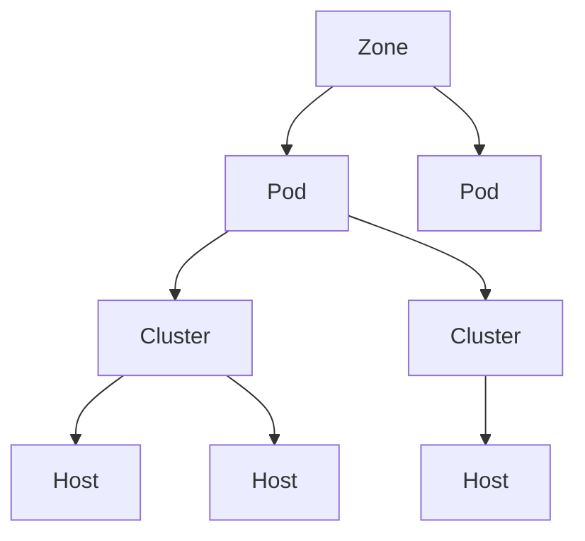

Apache CloudStack is open source software designed to deploy and manage large networks of virtual machines, as a highly available, highly scalable Infrastructure as a Service (IaaS) cloud computing platform. CloudStack is used by service providers to offer public cloud services, by enterprises to run on-premises private clouds, and by organizations building hybrid cloud solutions.

CloudStack is a turnkey solution that includes the entire "stack" of features most organizations want with an IaaS cloud: compute orchestration, Network-as-a-Service, user and account management, a full and open native API, resource accounting, and a first-class user interface.

## Key use cases

- **Public cloud services** — More than 150 known organizations use Apache CloudStack (or a commercial distribution) to offer public cloud services to their customers.
- **Private cloud** — Enterprises deploy CloudStack on-premises to provide self-service infrastructure to internal teams without relying on external providers.
- **Hybrid cloud** — CloudStack can be integrated into hybrid architectures that span both on-premises infrastructure and external cloud providers.

## Core features

<CardGroup cols={2}>
  <Card title="Compute orchestration" icon="server">
    Provision, start, stop, and migrate virtual machines across hypervisor hosts. Supports live migration, high availability, and automatic workload rebalancing.
  </Card>
  <Card title="Networking as a service" icon="network-wired">
    Full software-defined networking including virtual routers, VPNs, firewalls, load balancers, and isolated guest networks. Supports both basic and advanced networking zones.
  </Card>
  <Card title="Storage management" icon="database">
    Manage primary storage (local and shared) and secondary storage (templates, snapshots, ISOs). Supports NFS, iSCSI, Ceph/RBD, and local storage.
  </Card>
  <Card title="Multi-tenancy" icon="users">
    Full account and domain hierarchy with resource quotas, role-based access control, and isolated networking per tenant. Suitable for hosting providers and large enterprises alike.
  </Card>
  <Card title="Native API" icon="code">
    A full-featured, query-based API covers every operation in CloudStack. The same API powers the UI, CLI tools, and all third-party integrations.
  </Card>
  <Card title="Web UI" icon="display">
    A modern Vue.js-based management interface for administrators and end users. Supports dark mode, internationalization, and role-based views.
  </Card>
</CardGroup>

## Supported hypervisors

CloudStack supports the most widely used hypervisors in production deployments:

| Hypervisor | Notes |
|---|---|
| **KVM** | Recommended for new deployments; fully open source |
| **VMware vSphere** | Enterprise deployments on existing VMware infrastructure |
| **XenServer / XCP-ng** | Citrix XenServer and the open-source XCP-ng fork |
| **Hyper-V** | Microsoft Windows Server environments |
| **OVM** | Oracle VM |
| **LXC** | Linux containers |

<Note>
  A built-in simulator hypervisor is available for development and testing. It lets you run a full CloudStack environment without any physical hypervisor hosts.
</Note>

## Architecture overview

CloudStack organizes infrastructure into a hierarchy of logical units:

- **Zones** — A zone typically maps to a single data center. A CloudStack deployment can span multiple zones for geographic redundancy or multi-site operations.
- **Pods** — A pod represents a rack or row of hosts within a zone, sharing a Layer 2 network and one or more primary storage servers.
- **Clusters** — A cluster is a group of homogeneous hosts (same hypervisor and hardware configuration) within a pod. Virtual machines run on hosts within a cluster.
- **Hosts** — Physical servers running a hypervisor. CloudStack communicates with hosts via agents to manage VMs.

The management server sits outside this hierarchy and orchestrates all components — hypervisor hosts, storage, and networking — through a central control plane backed by a MySQL database.

## Management interfaces

Users can manage their cloud through any of these interfaces:

- **Web UI** — Browser-based management console at `http://<management-server>:8080`
- **CloudStack API** — A query-based HTTP API documented at `/api`
- **CloudMonkey** — Official command-line client for the CloudStack API

## Get started

<CardGroup cols={2}>
  <Card title="Quick start" icon="rocket" href="/quickstart">
    Run a local CloudStack developer environment using the built-in simulator in under an hour.
  </Card>
  <Card title="Installation" icon="wrench" href="/installation">
    Deploy the CloudStack management server on Ubuntu/Debian or RHEL/CentOS for production use.
  </Card>
  <Card title="Architecture" icon="sitemap" href="/architecture/overview">
    Understand zones, pods, clusters, networking, and storage in depth.
  </Card>
  <Card title="API reference" icon="code" href="/api/overview">
    Explore the full CloudStack query API for automation and integration.
  </Card>
</CardGroup>
